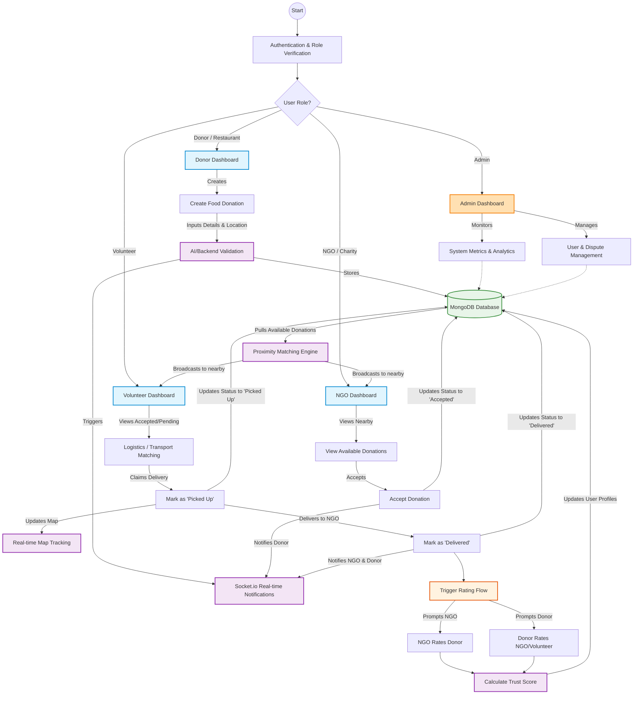

# Smart Food Redistribution System - Architecture & Flowchart

The following flowchart illustrates the entire lifecycle of a food donation within the platform, including the interactions between the three primary roles (Donor, NGO, Volunteer), the centralized logistics and matching engine, and the reputation system.

## System Components Explained

1. **Role-Based Dashboards**: The entry points for the platform. Donors create supply, NGOs consume supply, and Volunteers act as the bridge when NGOs lack their own transport.
2. **Matching Engine**: Calculates geographical proximity using geospatial queries to ensure perishable food is routed to the nearest willing recipient.
3. **Logistics Tracker**: Follows the lifecycle of the `Donation` document (`Pending` -> `Accepted` -> `Picked Up` -> `Delivered`).
4. **Reputation Engine**: A crucial trust-building mechanism. Once a delivery completes, the system locks the state and triggers mutual feedback, adjusting global Trust Scores.
